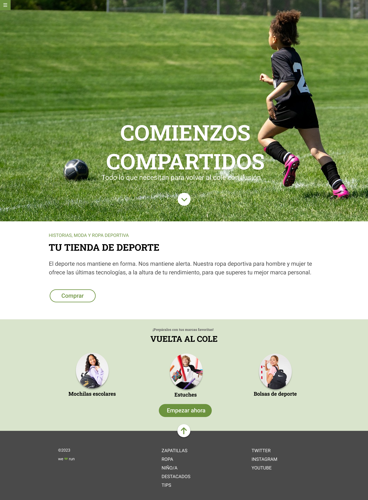

# Módulo 1 – Ejercicio de evaluación

## ✅ Descripción del ejercicio

Este proyecto consiste en **maquetar una página web responsive** a partir de un diseño proporcionado.

El objetivo principal es reproducir la composición y el estilo indicados, poniendo en práctica Flexbox, CSS Grid y media queries.
Además, se recomienda implementar pequeñas interacciones como transiciones y animaciones.

## 🚀 Tecnologías y lenguajes utilizados

- **HTML5**: estructura de la página y accesibilidad básica.

* **CSS3**:
  - Flexbox.
  - CSS Grid.
  - Media queries: adaptación responsive a diferentes tamaños de pantalla.
  - Backgrounds.
  - Transiciones.
  - Transformaciones.

- Control de versiones con **Git/GitHub**: flujo de trabajo del repositorio (clonado, commits y push).
